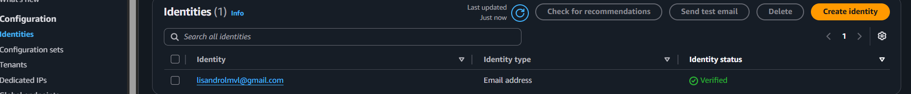
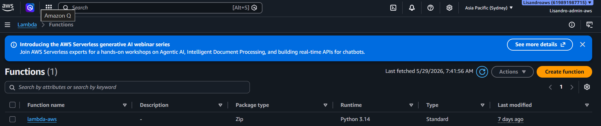
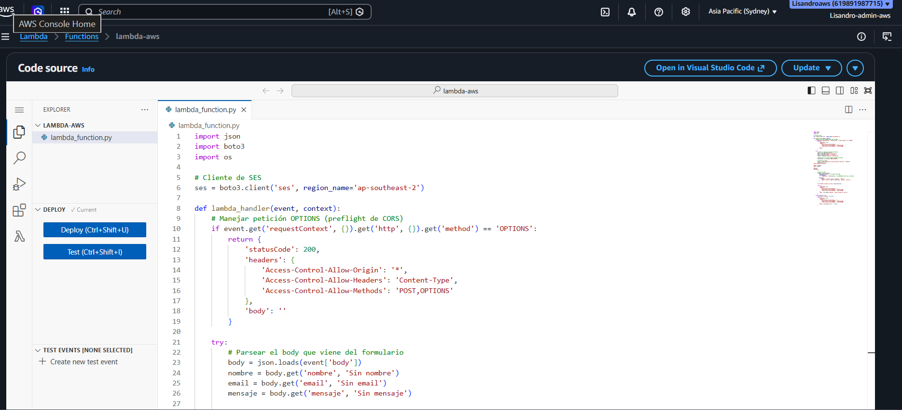
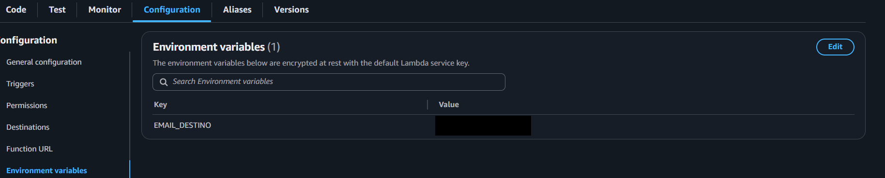
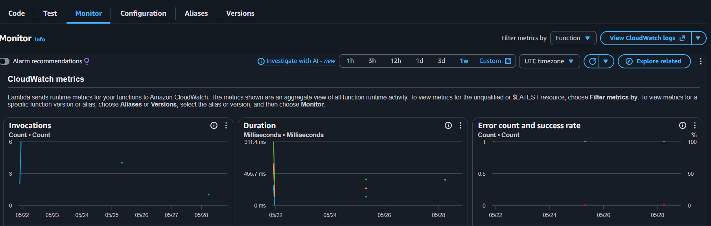
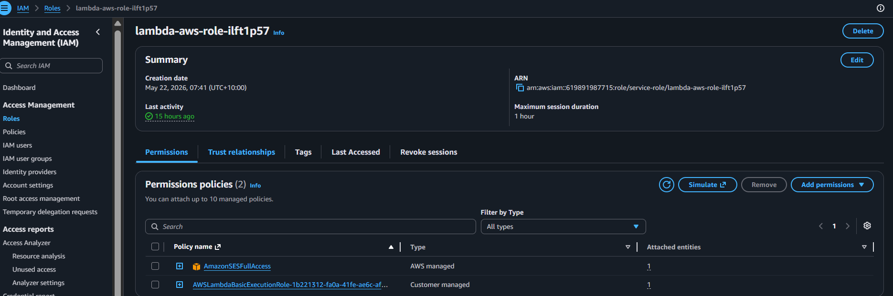

# Nivel 3 — Lambda + API Gateway + SES

## Objetivo

Agregar funcionalidad dinámica al portfolio estático mediante un formulario de contacto serverless. El usuario completa el formulario en el frontend, que llama a una API REST. API Gateway recibe la solicitud, invoca una función Lambda en Python 3.12 que valida los datos y envía el email a través de Amazon SES.

---

## Arquitectura del Nivel 3

```
Navegador
  │
  │ HTTP POST /contacto (JSON)
  ▼
API Gateway (REST API)
  │  CORS habilitado
  │  Método POST → integración Lambda Proxy
  ▼
Lambda Function (Python 3.12)
  │  Valida campos
  │  Formatea el mensaje
  ▼
Amazon SES
  │  Email verificado como remitente
  ▼
Bandeja de entrada del destinatario
```

---

## Servicios Configurados

### Amazon SES — Simple Email Service

SES se utiliza para el envío transaccional de emails desde la Lambda.

**Configuración realizada:**
- Verificación del email/dominio remitente en la consola de SES
- La cuenta opera en **modo sandbox** (solo envía a emails verificados)
- Para producción se debe solicitar salida del sandbox

**Screenshot de verificación:**



---

### AWS Lambda

Función serverless que actúa como backend del formulario de contacto.

**Configuración:**
- **Runtime:** Python 3.12
- **Handler:** `lambda_function.lambda_handler`
- **Memoria:** 128 MB (suficiente para esta carga)
- **Timeout:** 10 segundos
- **Región:** `ap-southeast-2` (Sydney)

**Variables de entorno:**

| Variable | Descripción |
|---|---|
| `RECIPIENT_EMAIL` | Email que recibe los mensajes del formulario |
| `SENDER_EMAIL` | Email verificado en SES usado como remitente |

**Código fuente:**

```python
import json
import boto3
import os

ses = boto3.client('ses', region_name='ap-southeast-2')

def lambda_handler(event, context):
    try:
        body = json.loads(event.get('body', '{}'))
        
        nombre = body.get('nombre', '').strip()
        email  = body.get('email', '').strip()
        mensaje = body.get('mensaje', '').strip()
        
        if not all([nombre, email, mensaje]):
            return {
                'statusCode': 400,
                'headers': cors_headers(),
                'body': json.dumps({'error': 'Todos los campos son requeridos'})
            }
        
        ses.send_email(
            Source=os.environ['SENDER_EMAIL'],
            Destination={'ToAddresses': [os.environ['RECIPIENT_EMAIL']]},
            Message={
                'Subject': {'Data': f'Mensaje de {nombre} — Portfolio'},
                'Body': {
                    'Text': {
                        'Data': f'Nombre: {nombre}\nEmail: {email}\n\nMensaje:\n{mensaje}'
                    }
                }
            }
        )
        
        return {
            'statusCode': 200,
            'headers': cors_headers(),
            'body': json.dumps({'message': 'Email enviado correctamente'})
        }
    
    except Exception as e:
        return {
            'statusCode': 500,
            'headers': cors_headers(),
            'body': json.dumps({'error': str(e)})
        }

def cors_headers():
    return {
        'Access-Control-Allow-Origin': '*',
        'Access-Control-Allow-Headers': 'Content-Type',
        'Access-Control-Allow-Methods': 'POST,OPTIONS'
    }
```

**Screenshots:**

| Descripción | Screenshot |
|---|---|
| Página principal de la función |  |
| Código fuente en la consola |  |
| Variables de entorno |  |
| Monitor de invocaciones |  |
| Permisos y rol de ejecución |  |

---

### API Gateway

REST API que expone la Lambda como endpoint HTTP accesible desde el frontend.

**Configuración:**
- **Tipo:** REST API (no HTTP API, para mayor control de CORS)
- **Endpoint:** Regional
- **Recurso:** `/contacto`
- **Método:** `POST` con integración Lambda Proxy
- **Método OPTIONS:** configurado para preflight CORS
- **Stage:** `prod` (URL de invocación pública)

**URL de ejemplo:**
```
https://xxxxxxxxxx.execute-api.ap-southeast-2.amazonaws.com/prod/contacto
```

**CORS Headers configurados:**
```
Access-Control-Allow-Origin: *
Access-Control-Allow-Headers: Content-Type
Access-Control-Allow-Methods: POST,OPTIONS
```

**Screenshots:**

| Descripción | Screenshot |
|---|---|
| Rutas y recursos de la API |  |
| Configuración CORS |  |

---

## Formulario en el Frontend

El HTML del formulario llama al endpoint de API Gateway mediante `fetch`:

```javascript
document.getElementById('contactForm').addEventListener('submit', async (e) => {
  e.preventDefault();
  
  const payload = {
    nombre:  document.getElementById('nombre').value,
    email:   document.getElementById('email').value,
    mensaje: document.getElementById('mensaje').value
  };
  
  try {
    const res = await fetch('https://TU_API_ID.execute-api.ap-southeast-2.amazonaws.com/prod/contacto', {
      method: 'POST',
      headers: { 'Content-Type': 'application/json' },
      body: JSON.stringify(payload)
    });
    
    const data = await res.json();
    alert(res.ok ? '¡Mensaje enviado!' : `Error: ${data.error}`);
  } catch (err) {
    alert('Error de conexión. Intenta nuevamente.');
  }
});
```

**Screenshots del formulario:**

| Descripción | Screenshot |
|---|---|
| Formulario listo para completar |  |
| Confirmación de envío exitoso |  |

---

## Permisos IAM

El rol de ejecución de Lambda requiere los siguientes permisos mínimos:

```json
{
  "Version": "2012-10-17",
  "Statement": [
    {
      "Effect": "Allow",
      "Action": [
        "ses:SendEmail",
        "ses:SendRawEmail"
      ],
      "Resource": "*"
    },
    {
      "Effect": "Allow",
      "Action": [
        "logs:CreateLogGroup",
        "logs:CreateLogStream",
        "logs:PutLogEvents"
      ],
      "Resource": "arn:aws:logs:*:*:*"
    }
  ]
}
```

---

## Prueba del Flujo Completo

1. Abrir el portfolio en CloudFront
2. Navegar a la sección de contacto
3. Completar nombre, email y mensaje
4. Hacer clic en "Enviar"
5. Verificar el mensaje de confirmación en pantalla
6. Comprobar la recepción del email en el destinatario configurado
7. Revisar los logs en CloudWatch Logs → `/aws/lambda/nombre-funcion`

---

## Troubleshooting

| Problema | Causa probable | Solución |
|---|---|---|
| Error 403 en la API | CORS mal configurado | Verificar método OPTIONS y headers en Lambda |
| Email no llega | Email remitente no verificado en SES | Verificar el email en la consola de SES |
| Error 500 en Lambda | Variables de entorno vacías | Revisar `SENDER_EMAIL` y `RECIPIENT_EMAIL` |
| Timeout | Lambda sin permisos para SES | Revisar el rol IAM de ejecución |
| Error "sandbox" | Destinatario no verificado | Verificar el email destino o salir del sandbox |
