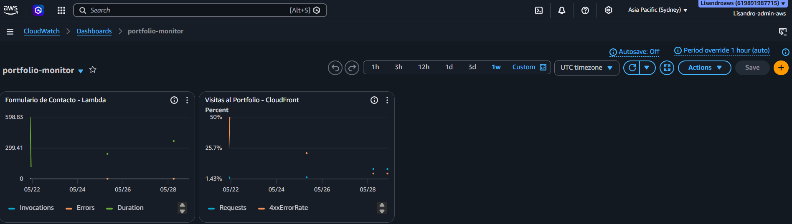
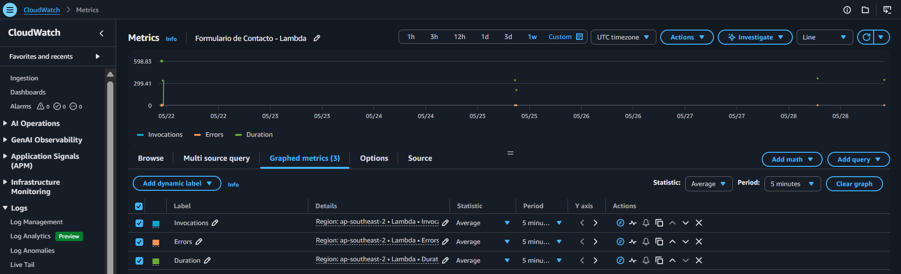
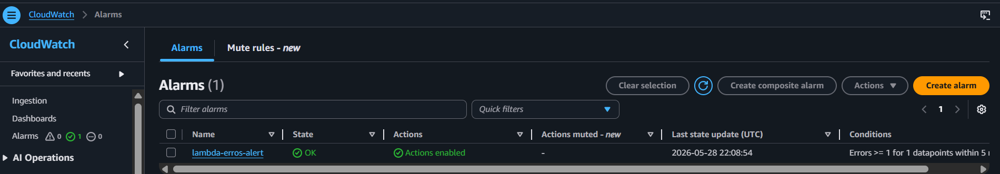
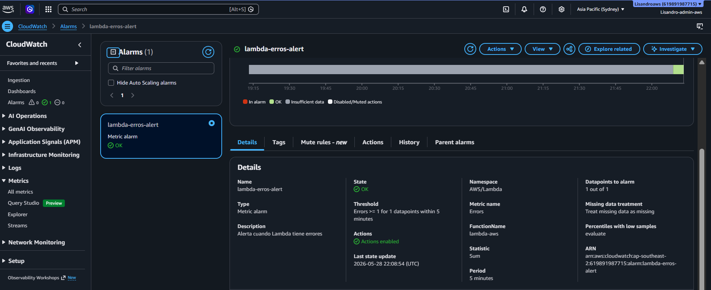
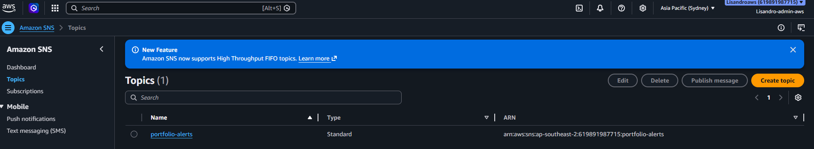
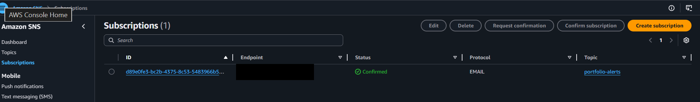

# Nivel 4 — CloudWatch + SNS + Alarmas

## Objetivo

Implementar monitoreo completo de la infraestructura serverless. CloudWatch recopila métricas automáticas de Lambda, las alarmas disparan notificaciones cuando se detectan anomalías, y SNS entrega esas alertas al email del administrador en tiempo real.

---

## Arquitectura del Nivel 4

```
Lambda Function
  │  (invocaciones, errores, duración, throttles)
  ▼
CloudWatch Metrics
  │
  ├──▶ Dashboard (visualización en tiempo real)
  │
  └──▶ Alarmas
           │  (umbral superado)
           ▼
          SNS Topic
           │
           ▼
       Suscripción Email
           │
           ▼
    Notificación al administrador
```

---

## Servicios Configurados

### Amazon CloudWatch — Dashboard

El dashboard centraliza todas las métricas relevantes en una sola vista.

**Métricas incluidas:**
- `Invocations` — número total de invocaciones de Lambda
- `Errors` — cantidad de errores en ejecución
- `Duration` — tiempo de ejecución por invocación (ms)
- `Throttles` — invocaciones rechazadas por límite de concurrencia
- `ConcurrentExecutions` — ejecuciones simultáneas

**Screenshots:**

| Descripción | Screenshot |
|---|---|
| Dashboard principal con widgets |  |
| Gráfico de métricas de Lambda |  |

---

### Alarmas de CloudWatch

Se configuraron alarmas para detectar situaciones críticas automáticamente.

#### Alarma 1 — Errores en Lambda

| Parámetro | Valor |
|---|---|
| **Métrica** | `Errors` (namespace `AWS/Lambda`) |
| **Función** | nombre-de-la-funcion |
| **Condición** | `>= 1` error en 5 minutos |
| **Período** | 5 minutos |
| **Estadística** | `Sum` |
| **Estado** | ALARM → notificación SNS |

#### Alarma 2 — Duración elevada

| Parámetro | Valor |
|---|---|
| **Métrica** | `Duration` |
| **Condición** | `>= 5000 ms` en promedio |
| **Período** | 5 minutos |
| **Estadística** | `Average` |
| **Estado** | ALARM → notificación SNS |

**Screenshots:**

| Descripción | Screenshot |
|---|---|
| Lista de alarmas configuradas |  |
| Detalle de una alarma |  |

---

### Amazon SNS — Simple Notification Service

SNS actúa como intermediario entre CloudWatch y el canal de notificación (email).

**Configuración del tópico:**

| Campo | Valor |
|---|---|
| **Tipo** | Standard |
| **Nombre** | `portfolio-alertas` (o similar) |
| **Región** | `ap-southeast-2` |

**Suscripción:**

| Campo | Valor |
|---|---|
| **Protocolo** | Email |
| **Endpoint** | tu-email@dominio.com |
| **Estado** | Confirmed (requiere clic en el email de confirmación de AWS) |

> ⚠️ La suscripción no queda activa hasta confirmar el email que envía AWS automáticamente al crear la suscripción.

**Screenshots:**

| Descripción | Screenshot |
|---|---|
| Tópico SNS creado |  |
| Suscripción confirmada |  |

---

## Flujo Completo de Alerta

```
1. Lambda arroja un error durante una invocación
      ↓
2. CloudWatch registra la métrica Errors += 1
      ↓
3. La alarma "Lambda-Errores" supera el umbral (≥ 1)
      ↓
4. CloudWatch publica un mensaje en el tópico SNS
      ↓
5. SNS entrega el email al suscriptor
      ↓
6. El administrador recibe la notificación en segundos
```

---

## Ejemplo de Email de Alerta

```
De: no-reply@sns.amazonaws.com
Asunto: ALARM: "Lambda-Errores" in Asia Pacific (Sydney)

You are receiving this email because your Amazon CloudWatch 
Alarm "Lambda-Errores" in the Asia Pacific (Sydney) region 
has entered the ALARM state.

Alarm Details:
  - Alarm Name:     Lambda-Errores
  - Alarm Arn:      arn:aws:cloudwatch:ap-southeast-2:...
  - State Change:   OK -> ALARM
  - Reason:         Threshold Crossed: 1 out of the last 1 
                    datapoints [1.0] was greater than or equal 
                    to the threshold (1.0).
  
Triggered At: 2026-05-29 08:00:00 UTC
```

---

## Permisos IAM Necesarios

No se requieren permisos IAM adicionales por parte del usuario para que CloudWatch publique en SNS. La integración usa permisos de servicio internos de AWS. Sin embargo, el rol de Lambda debe tener:

```json
{
  "Effect": "Allow",
  "Action": [
    "cloudwatch:PutMetricData"
  ],
  "Resource": "*"
}
```

> Las métricas de `AWS/Lambda` las publica el servicio Lambda automáticamente; no requieren código adicional.

---

## Métricas Clave de Lambda en CloudWatch

| Métrica | Descripción | Unidad |
|---|---|---|
| `Invocations` | Llamadas totales a la función | Count |
| `Errors` | Invocaciones que terminaron con error | Count |
| `Duration` | Tiempo de ejecución | Milliseconds |
| `Throttles` | Invocaciones rechazadas por concurrencia | Count |
| `ConcurrentExecutions` | Ejecuciones simultáneas en curso | Count |
| `IteratorAge` | Retraso en streams (si aplica) | Milliseconds |

---

## Troubleshooting

| Problema | Causa probable | Solución |
|---|---|---|
| No llegan alertas por email | Suscripción SNS no confirmada | Buscar email de AWS y hacer clic en "Confirm subscription" |
| Alarma siempre en INSUFFICIENT DATA | No hay invocaciones recientes | Invocar la función y esperar 1 ciclo de evaluación |
| Dashboard sin datos | Período de tiempo incorrecto | Ajustar el rango de tiempo en la consola de CloudWatch |
| Alarma no dispara | Umbral demasiado alto | Revisar la condición y reducir el umbral de prueba |
