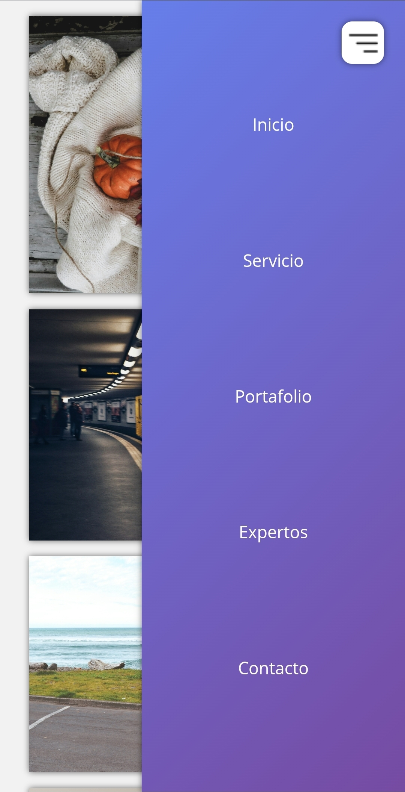
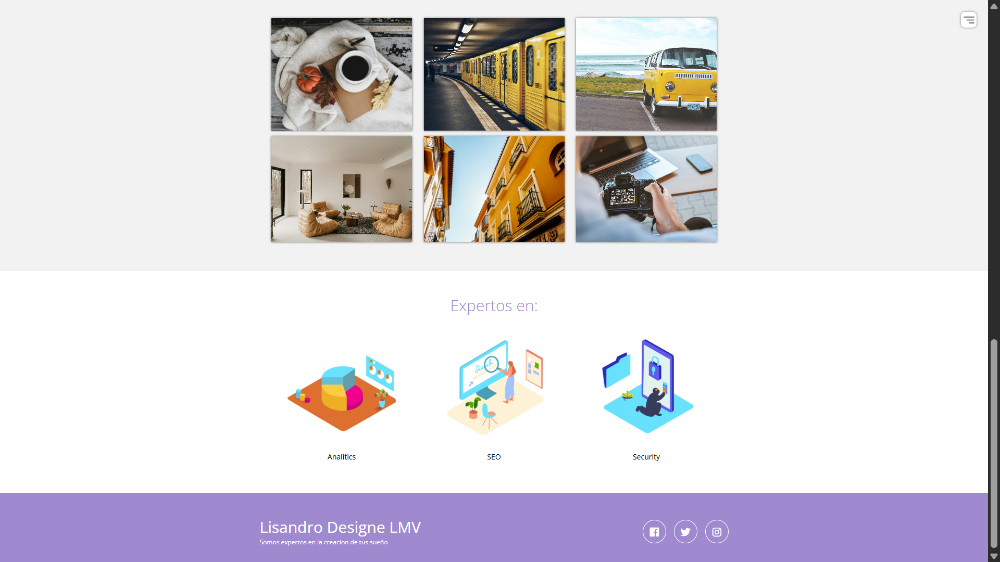
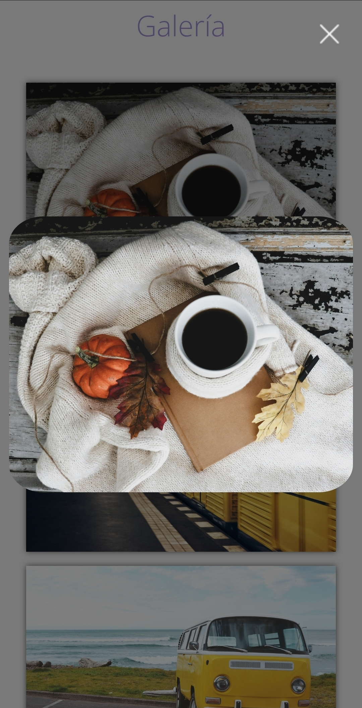

# Proyecto Landing Page - Lisandro Designe LMV

Landing page responsive creada con HTML, CSS y JavaScript para mostrar servicios, portafolio y expertos.

## Capturas de Pantalla

| Móvil | Escritorio |
|------|------------|
|  |  |

## Funcionalidad clave: Lightbox



## Funcionalidades
- Menú hamburguesa responsive
- Galería con Lightbox
- Secciones: Inicio, Servicio, Portafolio, Expertos y Contacto
- Footer con redes sociales
- Diseño responsive para desktop y móviles

## Tecnologías
- HTML5, CSS3 (Flexbox, Media Queries, Transiciones)
- JavaScript (DOM, eventos, lightbox)
- Iconos: Boxicons

## Estructura del proyecto
```
Front-End-PROY...
├─ css/
│   └─ estilos.css
├─ Html/
│   └─ index.html
├─ img/
│   (tus imágenes)
├─ js/
│   ├─ lightbox.js
│   └─ menu.js
└─ README.md
```

## Uso
1. Clonar el repositorio: `git clone https://github.com/Lisandro-LMV/Responsive-gallery-portfolio.git`
2. Abrir `index.html` en un navegador moderno.
3. Navegar por el menú o hacer scroll.
4. Click en imágenes para abrir Lightbox.

## Autor
**Lisandro Molina Viamonte**
- GitHub: [Lisandro-LMV](https://github.com/Lisandro-LMV)

