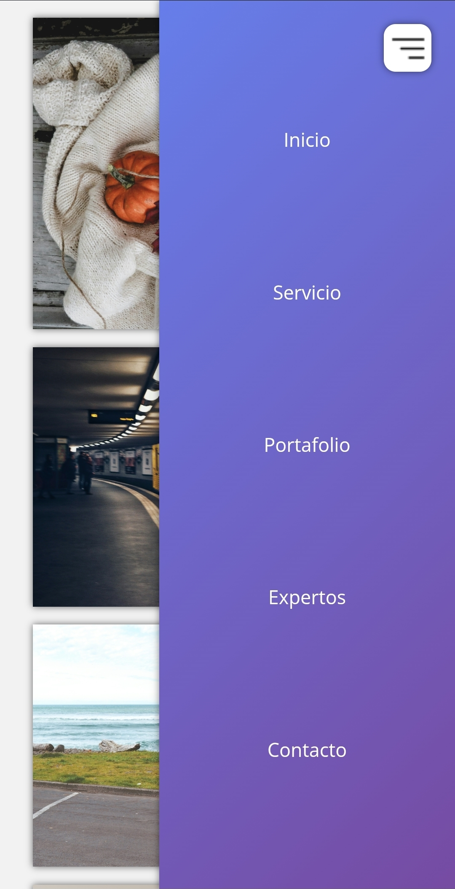
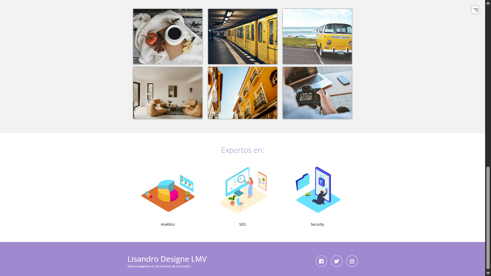

# Proyecto Landing Page - Lisandro Designe LMV

Landing page responsive creada con HTML, CSS y JavaScript para mostrar servicios, portafolio y expertos. Desplegada con arquitectura **100% serverless** en AWS.

## Capturas de Pantalla

| Móvil | Escritorio |
|------|------------|
|  |  |

## Funcionalidad clave: Lightbox


## Demo en Vivo
[Ver el portafolio online](https://lisandro-lmv.github.io/Responsive-gallery-portfolio/)  
*(Haz clic para navegar por el menú, la galería y el Lightbox en tiempo real)*

## Funcionalidades
- Menú hamburguesa responsive
- Galería con Lightbox
- Secciones: Inicio, Servicio, Portafolio, Expertos y Contacto
- Footer con redes sociales
- Diseño responsive para desktop y móviles

## Tecnologías
- HTML5, CSS3 (Flexbox, Media Queries, Transiciones)
- JavaScript (DOM, eventos, lightbox)
- Iconos: Boxicons

## Estructura del proyecto
```
Responsive-gallery-portfolio/
├── index.html
├── css/
│   └── estilos.css
├── Html/
│   └── (páginas adicionales)
├── Img/
│   (imágenes del portfolio)
├── js/
│   ├── lightbox.js
│   └── menu.js
├── Documentos-aws/
│   ├── README-AWS.md
│   ├── IAM-SETUP.md
│   ├── NIVEL-1.md
│   ├── NIVEL-2.md
│   ├── NIVEL-3.md
│   ├── NIVEL-4.md
│   └── BONUS-CICD.md
└── README.md
```

## Uso
1. Clonar el repositorio: `git clone https://github.com/Lisandro-LMV/Responsive-gallery-portfolio.git`
2. Abrir `index.html` en un navegador moderno.
3. Navegar por el menú o hacer scroll.
4. Click en imágenes para abrir Lightbox.

---

## 📦 Despliegue en AWS

Este proyecto está desplegado en Amazon Web Services con arquitectura **serverless completa**, cubriendo hosting, CDN, backend sin servidor, monitoreo y CI/CD automatizado.

> **Región:** `ap-southeast-2` (Sydney) · **Lambda:** Python 3.12

### 🗺️ Niveles Completados

- ✅ **Nivel 1 — S3 Static Hosting:** Hosting web estático desde bucket S3
- ✅ **Nivel 2 — CloudFront (CDN + HTTPS):** Red de distribución global con SSL
- ✅ **Nivel 3 — Lambda + API Gateway + SES:** Formulario de contacto serverless
- ✅ **Nivel 4 — CloudWatch + SNS + Alarmas:** Monitoreo y alertas en tiempo real
- ✅ **Bonus — CI/CD con GitHub Actions:** Deploy automático al hacer push a `main`

### 🏗️ Arquitectura AWS

```
Usuario
  │
  ▼
CloudFront (CDN + HTTPS)
  │
  ├──▶ S3 Bucket (HTML / CSS / JS / Imágenes)
  │
  └──▶ API Gateway → Lambda (Python 3.12) → SES
                          │
                     CloudWatch + SNS
                     (métricas y alertas)
```

### 🌐 URLs del Proyecto

| Entorno | URL | Estado |
|---|---|---|
| **Producción (CloudFront)** | `d5q5g3hfj9ssq.cloudfront.net` | ✅ Activo |
| **Direct S3 Endpoint** | `http://portfolio-lisandro-lmv.s3-website-us-east-1.amazonaws.com` | 🔒 Restringido vía CloudFront OAC |

### 📊 Servicios AWS Utilizados


### 📚 Documentación Técnica

| Documento | Descripción |
|---|---|
| [README-AWS.md](Documentos-aws/README-AWS.md) | Introducción y overview general |
| [IAM-SETUP.md](Documentos-aws/IAM-SETUP.md) | Configuración de usuarios y políticas |
| [NIVEL-1.md](Documentos-aws/NIVEL-1.md) | S3 Static Hosting |
| [NIVEL-2.md](Documentos-aws/NIVEL-2.md) | CloudFront + HTTPS |
| [NIVEL-3.md](Documentos-aws/NIVEL-3.md) | Lambda + API Gateway + SES |
| [NIVEL-4.md](Documentos-aws/NIVEL-4.md) | CloudWatch + SNS + Alarmas |
| [BONUS-CICD.md](Documentos-aws/BONUS-CICD.md) | CI/CD con GitHub Actions |

### 💰 Costo del Despliegue

**Actual:** $0.00/mes (dentro de AWS Free Tier)

---

## Autor

**Lisandro Molina Viamonte**  
Junior Developer · AWS Cloud

[](https://github.com/Lisandro-LMV)
